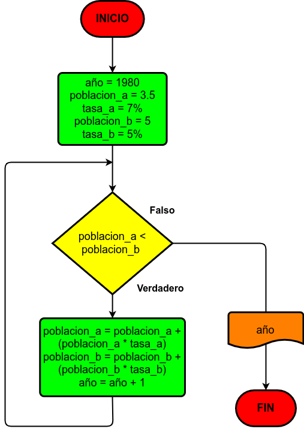

# Ejercicio 15

En 1980 la ciudad A tenía 3.5 millones de habitantes, y una tasa de crecimiento del 7% anual; y la ciudad B tenía 5 millones y una tasa de crecimiento del 5% anual. Si el crecimiento poblacional se mantiene constante en las dos ciudades, hacer el diagrama de flujo y el programa en Python que calcule e imprima en qué año la población de la ciudad A es mayor que la de la ciudad B.

# Diagrama de flujo

