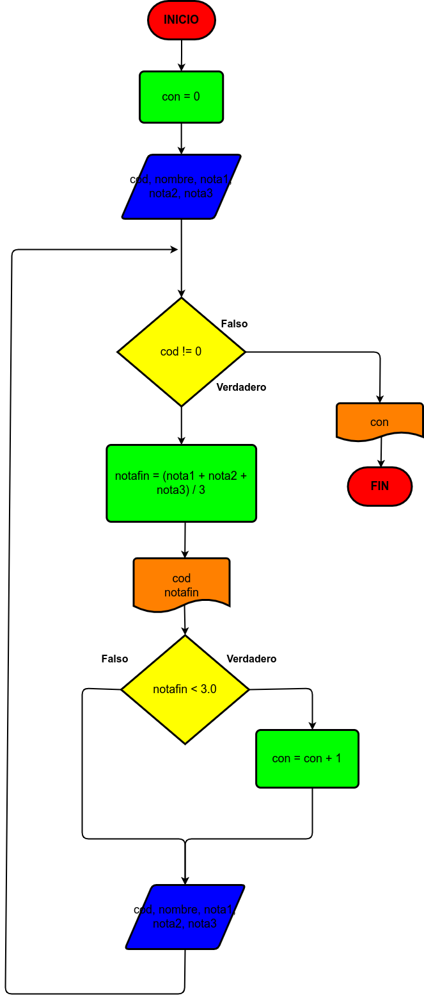

# Ejercicio 1

Hacer el diagrama de flujo y el programa en Python, que por cada estudiante lea el código, y el nombre, y las notas de los tres parciales de una materia, y que calcule e imprima el código, el nombre, y la nota final de cada estudiante. No sabemos cuántos estudiantes son, pero después de la información del último, se introduce 0 en el campo correspondiente al código, de modo tal que sirva como **centinela**, para indicar cuando terminan los datos de entrada. También se debe informar al final cuántos estudiantes perdieron la materia.

# Diagrama de flujo 1

