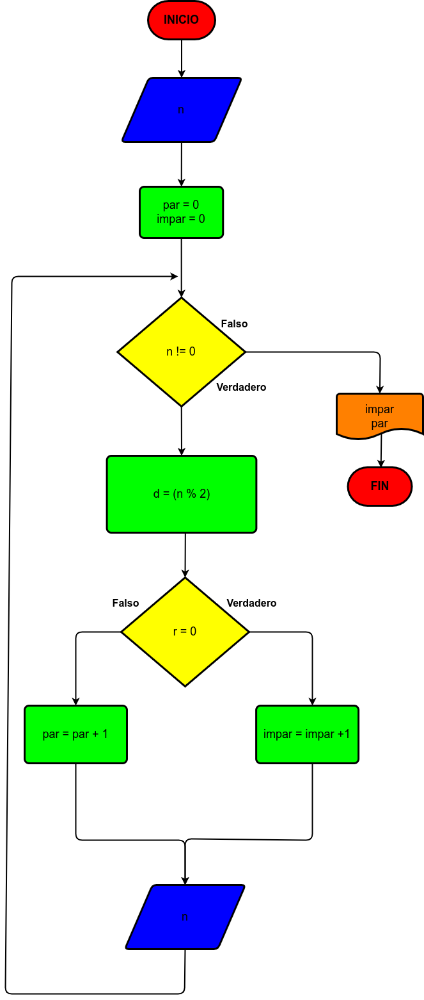

# Ejercicio 2

Hacer el diagrama de flujo y el programa en Python, que lea números enteros y positivos (uno en cada lectura), y que averigüe e imprima cuándo son pares y cuando son impares. Para terminar, utilizaremos el registro centinela, cuando el valor del número leído sea cero.

# Diagrama de flujo 2

