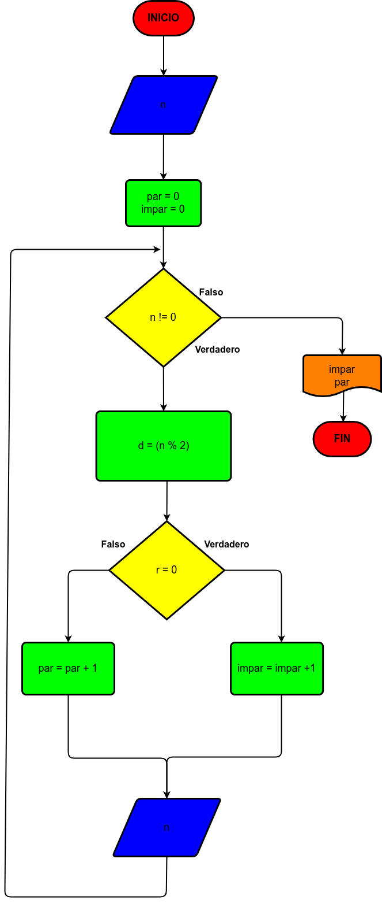

# Ejercicio 3

El cajero de un banco solo dispone de billetes de $10.000, $2.000 y $100. Su función es cambiar los cheques a los clientes, dándoles el menor número posible de billetes. Asumiendo que todos los cheques son múltiplos de $100, hacer el diagrama y el programa que reciba el valor del cheque a cambiar y que le informe al cajero cuántos billetes de cada denominación debe entregar. Como no se sabe cuántos clientes vienen en un día, el programa debe terminar cuando reciba un cero como valor del cheque, y al final del día debe informar cuántos billetes de cada denominación se gastaron.

# Diagrama de flujo 3

