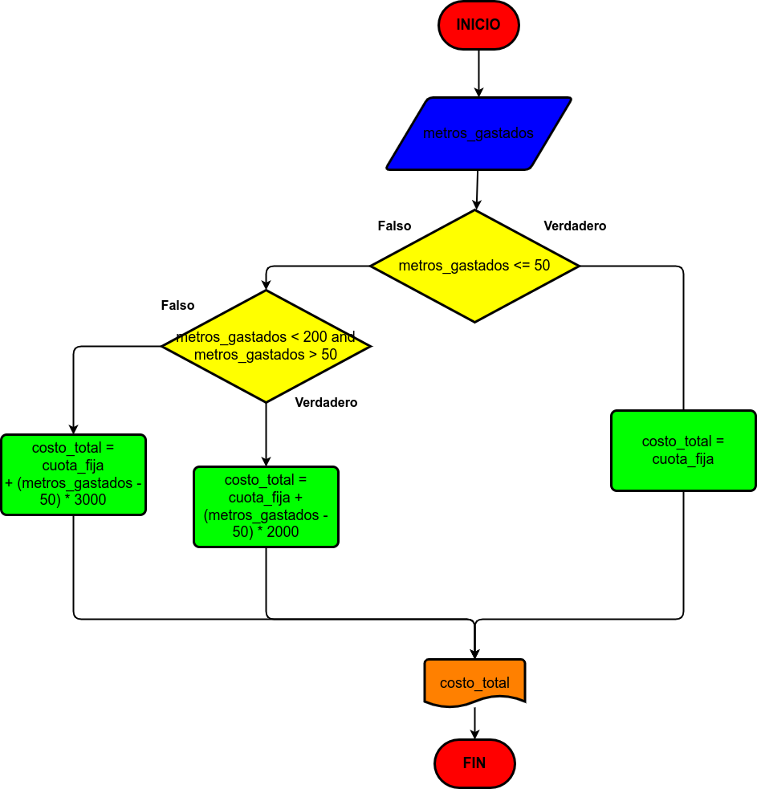

# Ejercicio 9

Calcular el gasto de agua de una vivienda tomando en cuenta la cantidad de metros cubicos gastados, siendo el sistema de cobro el siguiente:

- La cuota fija mensual es de 10 mil pesos.
- Los primeros 50 metros cubicos son gratis.
- Entre 50 y 200 metros se cobra el metro cubico a 2000 pesos
- A partir de 200 metros cubicos se cobra el metro cubico a 3000 pesos

# Diagrama de flujo

