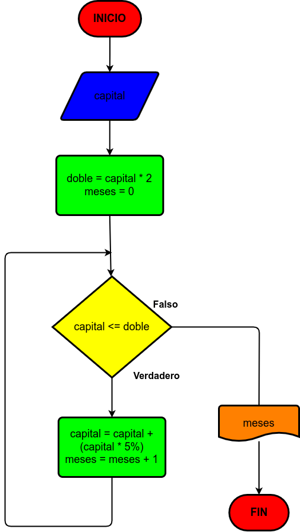

# Ejercicio 13

Hacer el diagrama de flujo y el programa en Python, que lea un capital "c", y que averigue e imprima, en cuántos meses se duplica, si lo colocamos a un interes compuesto del 5% mensual.

# Diagrama de flujo

